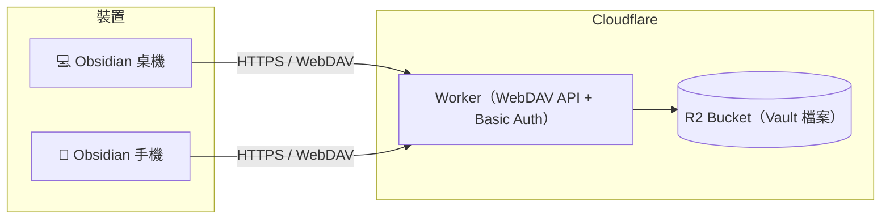

# obsidian_second_brain-Worker-Sync

用 **Cloudflare Workers + R2** 自架的 Obsidian Vault 同步後端。
對外提供 **WebDAV API**，搭配 Obsidian 社群外掛 [remotely-save](https://github.com/remotely-save/remotely-save)，
讓桌機、筆電、iOS / Android 手機都能同步同一個 Second Brain 知識庫——
**不需訂閱 Obsidian Sync，檔案存放在自己的 Cloudflare 帳號裡。**



## 特色

- **免費額度內幾乎零成本**：Workers 每天 10 萬次請求、R2 10 GB 儲存，個人知識庫綽綽有餘
- **跨平台**：remotely-save 支援 Windows / macOS / Linux / iOS / Android
- **完整 WebDAV 子集**：PROPFIND / GET / HEAD / PUT / DELETE / MKCOL / MOVE / COPY / LOCK
- **安全**：Basic Auth（SHA-256 常數時間比對）、全 HTTPS、R2 私有 bucket 不對外公開
- **中文檔名友善**：完整處理 URL encode / XML 跳脫
- **多 Vault 支援**：用 `VAULT_PREFIX` 在同一個 bucket 內隔離多個知識庫

## 前置需求

- [Cloudflare 帳號](https://dash.cloudflare.com/sign-up)（免費方案即可）
- [Node.js](https://nodejs.org/) 18+
- 本專案已 clone 到本機並 `npm install`

## 部署步驟（約 5 分鐘）

### 1. 登入 Cloudflare

```powershell
npx wrangler login
```

會開啟瀏覽器完成 OAuth 授權。

### 2. 建立 R2 Bucket

```powershell
npx wrangler r2 bucket create obsidian-second-brain
```

> bucket 名稱若改成別的，記得同步修改 `wrangler.toml` 裡的 `bucket_name`。

### 3. 設定同步用帳號密碼（Secrets）

```powershell
npx wrangler secret put AUTH_USERNAME
npx wrangler secret put AUTH_PASSWORD
```

依提示輸入自訂的帳號與**強密碼**。這組帳密就是之後 Obsidian 要填的 WebDAV 憑證。

### 4. 部署

```powershell
npm run deploy
```

完成後會得到 Worker 網址，例如：

```
https://obsidian-second-brain-sync.<你的子網域>.workers.dev
```

### 5. 驗證部署（選用）

```powershell
powershell -ExecutionPolicy Bypass -File scripts/smoke-test.ps1 `
  -BaseUrl "https://obsidian-second-brain-sync.<你的子網域>.workers.dev" `
  -User "<帳號>" -Pass "<密碼>"
```

17 項全綠即代表後端運作正常。

## Obsidian 設定（remotely-save）

1. Obsidian → 設定 → 社群外掛 → 瀏覽 → 搜尋 **remotely-save** → 安裝並啟用
2. 進入 remotely-save 設定頁：
   - **Choose service**：`WebDAV`
   - **Server Address**：`https://obsidian-second-brain-sync.<你的子網域>.workers.dev`
   - **Username / Password**：步驟 3 設定的帳密
   - **Auth Type**：`Basic`
3. 點 **Check Connectivity** 確認連線成功
4. 建議設定：
   - 同步間隔：依喜好（例如 10 分鐘自動同步）
   - **Password for end-to-end encryption**：若重視隱私可設定，雲端只存密文（所有裝置需填相同密碼）
   - **Skip large files**：免費版 Workers 單一請求上限 100 MB，建議略過超過 50 MB 的附件
5. 按 ribbon 的同步按鈕（或快捷鍵）執行首次同步
6. **其他裝置**：重複步驟 1–2 填入相同伺服器與帳密即可

> ⚠️ 首次在「已有內容的新裝置」上同步前，建議先備份該裝置的 vault，
> 並確認合併方向符合預期（remotely-save 以檔案修改時間判斷新舊）。

## 本地開發

```powershell
copy .dev.vars.example .dev.vars   # 填入測試用帳密
npm run dev                        # 啟動 http://localhost:8787（R2 為本地模擬）
npm run smoke                      # 跑 17 項 WebDAV 煙霧測試
npm run typecheck                  # TypeScript 型別檢查
```

## 專案結構

```
├── src/
│   ├── index.ts      # Worker 入口：Basic Auth 驗證、CORS、錯誤處理
│   ├── webdav.ts     # WebDAV 方法處理（PROPFIND/GET/PUT/DELETE/MKCOL/MOVE/COPY/LOCK）
│   └── xml.ts        # 207 Multi-Status XML 產生、跳脫與 href 編碼
├── scripts/
│   └── smoke-test.ps1# 端對端煙霧測試（相容 Windows PowerShell 5.1+）
├── wrangler.toml     # Worker 設定與 R2 binding
└── .dev.vars.example # 本地開發憑證範本
```

### 實作說明

- R2 是扁平物件儲存，「目錄」以零位元組 marker 物件（key 以 `/` 結尾）+ 前綴列舉實現
- 檔案 key = vault 相對路徑；PROPFIND 以 `list(prefix, delimiter="/")` 重建目錄樹
- MOVE/COPY 對目錄為遞迴操作；DELETE 目錄會批次清除前綴下所有物件
- LOCK/UNLOCK 為無狀態假鎖，僅供需要鎖定的客戶端相容使用（remotely-save 不使用）

## 限制與注意事項

| 項目 | 說明 |
|:--|:--|
| 單檔大小 | Workers 請求體上限約 100 MB（免費方案），大附件建議略過或改用 Git |
| 版本歷史 | 本方案不保留歷史版本；建議 vault 同時搭配 Git 備份（如現有的 github-sync） |
| 衝突處理 | 單機編輯後立即同步可避免多機衝突；remotely-save 以 mtime 判斷 |
| workers.dev 網域 | 預設網域即可使用，也可在 Cloudflare 後台綁定自己的網域 |

## 費用估算（免費額度）

| 資源 | 免費額度 | 個人知識庫典型用量 |
|:--|:--|:--|
| Workers 請求 | 100,000 次 / 天 | 每日數百～數千次 |
| R2 儲存 | 10 GB | 純文字筆記通常 < 1 GB |
| R2 Class A（寫入） | 100 萬次 / 月 | 遠低於額度 |
| R2 Class B（讀取） | 1,000 萬次 / 月 | 遠低於額度 |
| R2 出口流量 | 免費 | — |

## License

MIT